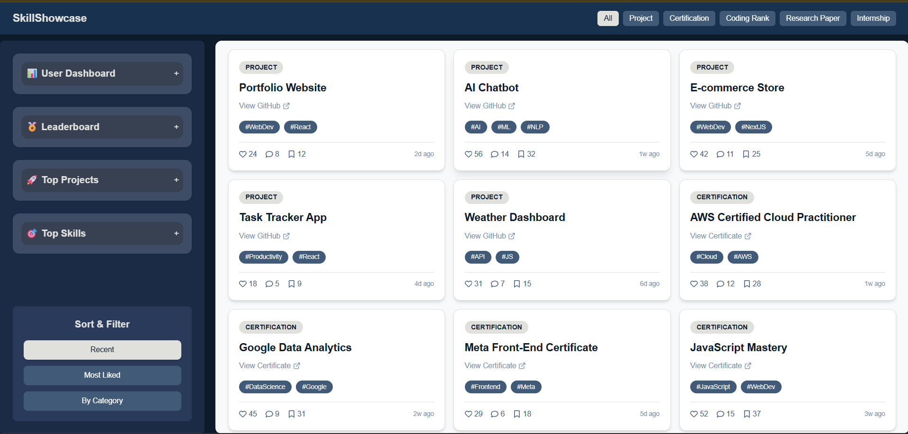
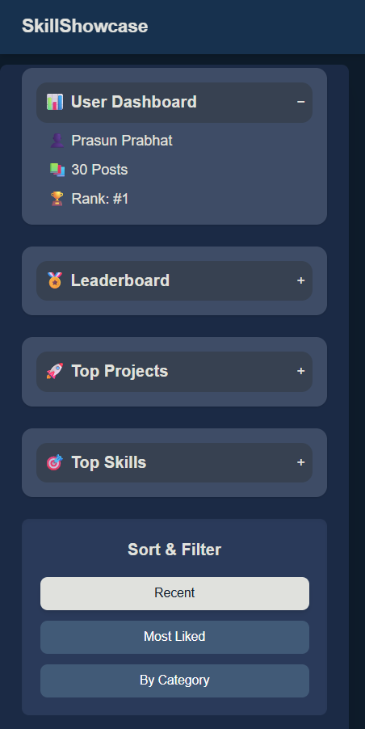

# 🚀 SkillShowcase

SkillShowcase is a dynamic and responsive frontend application that allows users to display and explore various skills, certifications, coding achievements, internships, and projects. It is designed to visually present a developer’s profile in a clean and interactive format.

### 🎞 Live Demo (GIF)


🔗 [🚀 Live Now](https://your-live-project-link.com)
---

## 📌 Project Overview

SkillShowcase serves as a personal or portfolio dashboard where users can:

- View categorized skill cards (Projects, Certifications, Coding Ranks, Research Papers, Internships)
- Explore a live leaderboard of top users
- Discover trending skills and projects
- Filter and sort posts by category or popularity
- See likes, comments, and save counts for each post

The UI is fully responsive, intuitive, and focused on enhancing visibility of technical accomplishments.

---

## 🛠 Tech Stack Used

| Category        | Technologies                                      |
|-----------------|---------------------------------------------------|
| 🧠 Core         | **React.js**, **JavaScript**                      |
| 🎨 Styling      | **Tailwind CSS**, Custom Utility Classes          |
| 📦 State/Props  | React Hooks (`useState`, props)                   |
| 🧱 UI Icons     | `react-icons` (FontAwesome Icons) for the like icon , Comment icon and menu bar[hamburgur menu]               |
| 📁 Project Type | Frontend-Only (No backend integration yet)        |

---

## ✨ Key Features

### 🔹 Post Filtering & Sorting
- Filter posts by type (Project, Certification, etc.)
- Sort posts by:
  - Recent
  - Most Liked
  - By Category (e.g., `#AI`, `#WebDev`)

### 🔹 Components Breakdown
- **Navbar**: Fixed header with category filters
- **Sidebar**: Displays User Dashboard, Leaderboard, Top Projects, Top Skills, and sort options
- **Post Cards**: Interactive cards for each post type with like, comment, save counters

### 🔹 Responsive Design
- Fully mobile and tablet compatible
- Flex/grid layouts optimized for various screen sizes

### 🔹 UI/UX Focus
- Clean, modern look with dark-blue themed with white palette
- Scroll-hidden sidebar and scrollable post grid for better UX

---

## 🖼 Sample Screenshots

### 🧩 SkillShowcase Dashboard


### 🧩 SkillShowcase Sidebar


### 🗂 Post-Card View


---

## 📂 Project Setup (for local use)

```bash
# Clone the repository
git clone https://github.com/PrasunPrabhat/SkillShowCase-explore-Frontend.git

# Navigate into the project directory
cd skillshowcase

# Install dependencies
npm install

# Start the development server
npm run dev
````

---
